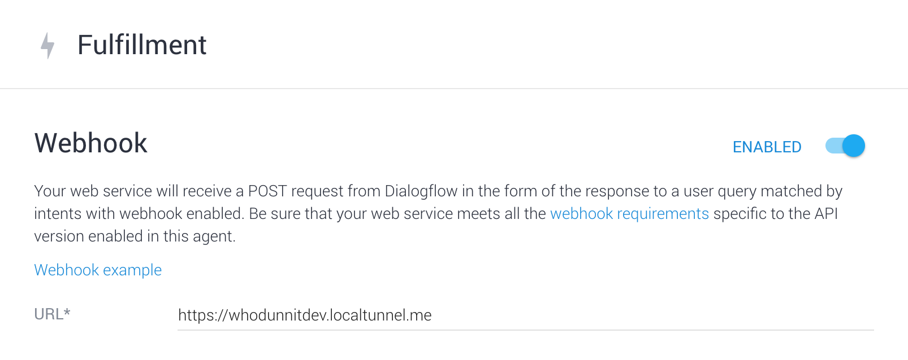

# Grilled: Murder Mystery


## Concept

We wanted to create a deep and multifaceted experience that could showcase the SSML capabilities of Google Voice Assistant. So to do it, we created Grilled: A Whodunnit. It’s a murder mystery using a voice app interface (namely, Actions on Google). The user takes on the role of the detective who's been called in to crack the case. Along the way they have to interview 4 suspects, and each of them comes with their own compelling motive for committing the crime. The goal is to interrogate each suspect, gather evidence and ultimately solve the murder.


## Writing the Story

While you can script a murder mystery, it’s impossible to guess which questions users might ask. So how do you account for it? You could take a brute-force approach and write responses until your fingers bleed, but that's not sustainable (or even ethical). Instead, our approach creates a story with responses that leads the user organically from one question to the next, providing a safety net in case they get lost.

We started out by visualizing the story, and interrogations, with mind maps. 


### Commonly Asked Questions

> Where were you on the night of the murder?!

Most people have seen enough TV crime dramas to have a repertoire of interrogation questions; asking suspects about their alibis, or even relationship with the victim. So that’s where we begin our story. From there, we respond in a way that leads the user deeper into the mystery. 


### Implicitly Guided Conversations

On the surface, the interrogation scenario is an open-ended conversation between the user and the suspect. However, we actually want to guide the user to ask about specific plot points that will eventually help them solve the murder.

We wrote our responses with a loose template of **priming**, **informing**, and **leading**. Priming is a connective phrase that allows the user to get into "listening mode." Informing is where we give the response to the user's question, and leading is a way of guiding the user into asking about a particular subject. This structure helps our users remember what they heard, and suggests a relevant topic for the next query. 

User

> Who do you think killed Betsy?

Brandi

> I definitely didn’t do it. My grandmother hated her more than anyone.

User

> Who is your grandmother?

Or if they already know that it's Constance...

> Let me talk to Constance


### Gracefully Repairing the Conversation

And in case the user gets stuck, they’re not alone. Police Chief Hawkins serves as their partner, stepping in from time to time to give advice on how to conduct the interrogation. This mechanic is our way of repairing the conversation when the user asks something irrelevant, or something we don't have a response for. 

For example, if the user is drawing a blank and doesn’t respond, Hawkins jumps in and guides the user back to a more productive line of questioning. 

> Listen closely to the suspects’ responses. Are they revealing information you want to ask follow-up questions on?

#### Give Relevant Advice

We realized early on that randomized hints don’t work very well. Sometimes the hint would point to a response the user already heard, and other times it would give the same hint in sequence. We needed some logic for determining how we should help the user, depending on where they were in the story. 

1. Don’t give hints that point to responses that have already been heard.
2. Don’t give the same hint twice in a row.
3. If the user hears enough hints, guide them more directly toward responses that will help solve the case.


### User Testing

Testing the app was crucial, but of course we were all too close to the project to trust our results. So we pulled in friends and coworkers who weren’t familiar with the project. Our first test session went anything but smoothly; the users asked a plethora of questions that we hadn’t thought of. Some of them even tried making casual conversation with the suspects!

> How are you doing?

These sessions helped bolster our repertoire of inputs, informed the writing, and lead us to the **prime / inform / lead** technique.  We also found that we needed to preface testing sessions by telling users not to ask us questions about how to interact with the app. Otherwise, they would ask us for help as soon as they were confused. 

Observing the users struggle through the early versions helped us restructure to make it easier to navigate the story. And it gave us suggestions on how to ease pain-points.


# Tech

This project uses [Dialogflow](https://dialogflow.com) for processing user inputs, and a NodeJS [Cloud Function](https://firebase.google.com/docs/functions/) for determining responses.

The code was written in a few weeks on Mac, but could work on linux, or even Bash on Windows if you are feeling adventurous.

## Approach

The dialogflow.com site is great for some things, but it doesn’t expose the full range of functionality in the platform. For that, you have to use the API. We created a command-line interface that enabled us to quickly push updates after making changes to the code. 

`dialogflow update intents --input=path/to/intents.json`

Nobody likes writing json files. They are a pain, and don’t enforce validity of the structure. With this in mind, we created json builder classes. The code is much more compact, and default values are assigned where needed.

```
    let intent = new Intent(k)
        .userPhrases(userPhrases)
        .parameters(parameters.map((p) => {
            return new Intent.Parameter(p.name, p.opts)
        }))
        .contexts(contexts)
        .outputContexts(outputContexts)
        .action(action)
        .build()

```

## SSML (Speech-Synthesis Markup Language)

We used SSML to create the voices for each character and play sounds.

If you look at the [AOG SSML docs](https://developers.google.com/actions/reference/ssml), you won’t see the voice tag, but that is how we toggled between male and female voices. There are 4 combinations total (2 male, 2 female), so that gives us 4 characters out of the box.

```
<voice gender=”female” variant=”1”>Character 1</voice>
<voice gender=”female” variant=”2”>Character 2</voice>
<voice gender=”male” variant=”1”>Character 3</voice>
<voice gender=”male” variant=”2”>Character 4</voice>
```

In order to impart some personality in our characters, we used the prosody tag. It enables us to modulate pitch and rate of speech. This is generally neat, but also we needed a 5th character!

```
<voice gender=”male” variant=”1”>
    <prosody rate=“95%” pitch=”-8%”>
        I am police chief Hawkins. Welcome to the case, detective.
    </prosody>
</voice>
```

## Account setup

[Create a new Dialogflow agent](https://dialogflow.com/docs/getting-started/building-your-first-agent), then delete the default intents.

## Deploying

### Dialogflow intents and entities

Create a directory dialogflow-agent/.access_tokens/ and add a file for each app you want to deploy to (e.g. dev, stage, production). [Get your developer access token](https://dialogflow.com/docs/reference/agent/) from Dialogflow and paste into the corresponding token file.

From the dialogflow-agent dir, run a specific version of the command `npm run update:{entities|intents}:{dev|stage|prod}` to publish objects to dialogflow.

You can also use the dialogflow CLI directly. The command below gets all of the intents and writes them to a json file.

`./dialogflow-agent/bin/dialogflow get intents -t=dev >> intents.json`

### The webhook

Run `npm run deploy:dev`, which is an alias for a firebase command. When complete, it will show the url that the function was published to. Use this url in the [fulfillment](https://dialogflow.com/docs/fulfillment) section of Dialogflow.


## Development

There are two main sections in this project: the listener (Dialogflow agent), and the responder (the webhook).

The Dialogflow generator is used to create intent and entity objects, and publish them to a Dialogflow agent.

The webhook code runs in a firebase function, and gets hit when a user interacts with the app.

### Install dependencies

- [Install NodeJS](https://nodejs.org/en/download/)
- [Install PM2](http://pm2.keymetrics.io/)
- Install firebase CLI. `npm i -g firebase-tools`
- Run `npm install` in `functions/`, `dialogflow-agent/`, and `scraper/`

### Running the project locally

In functions/package.json, change the values passed to the localtunnel script (e.g. whodunnitdev) to something unique.

Start the dev environment by running `npm run serve`, then `npm run localtunnel:dev`. This will start a local server and expose a public url via localtunnel.

💥💥💥WARNING: using localtunnel exposes your server to the whole internet.💥💥💥

The output of serve will show a local url, and the output of localtunnel will show a remote url. Use the path of the local, combined with the base of the remote. You will need to paste this into the Dialogflow fulfillment url field.



Dialogflow is a remote service, so you will need to deploy entities and intents before it will work in your local environment (see deployment section).


